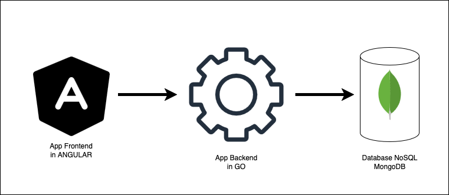

# REGISTRO ACCESSI

Il progetto è costituito da tre componenti principali:

- Microservizio Frontend **Angular**
- Microservizio Backend **Golang** con framework web **Gin**
- Dabase NoSQL **MongoDB**

